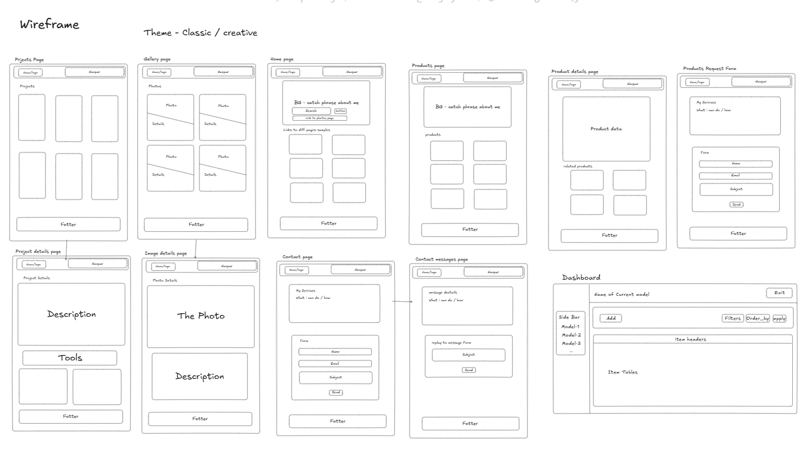
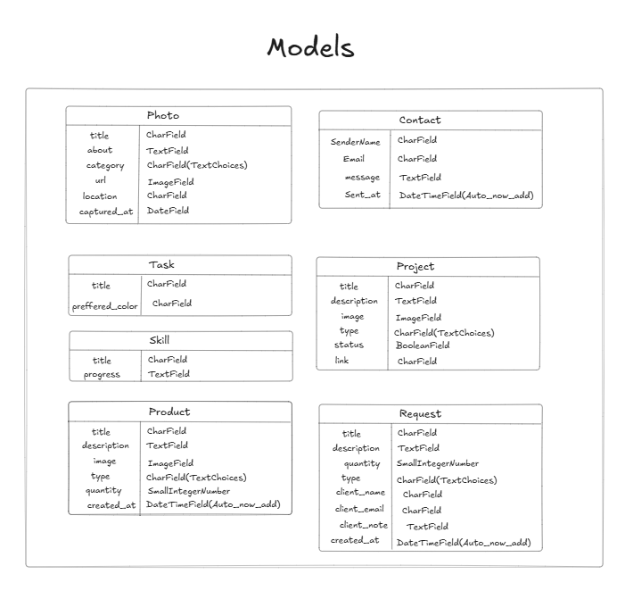
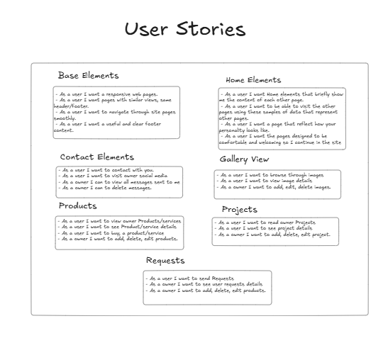

# UNIT-2-PROJECT

## HmzH a Personal Portfolio Website

A personal website is website that represents you , your work , your career , your interests and so on. It could be highly stylish , fun, or simple, serious and so on. You choose how you represent yourself online !

## WireFrame

### User Stories, Wireframes & UML links
[Wireframe](https://excalidraw.com/#json=zROztoeX-ggjcqCuF9Ri8,EtdMW_nS0n4p0TVd9hT1bQ)

## HmzH Portfolio
Personal Portfolio website that shows my favorite interests in the world, Programming Projects and Photography, I will present my coding projects and Photos I took that is think it worth showing everybody.

## Features List
- Home View
- Projects View
- Photography View
- About me Page
- Contact Me
- Products/ Services
- Requesting Products
- Administration Dashboard for controlling models data (view, add, edit, and delete)

